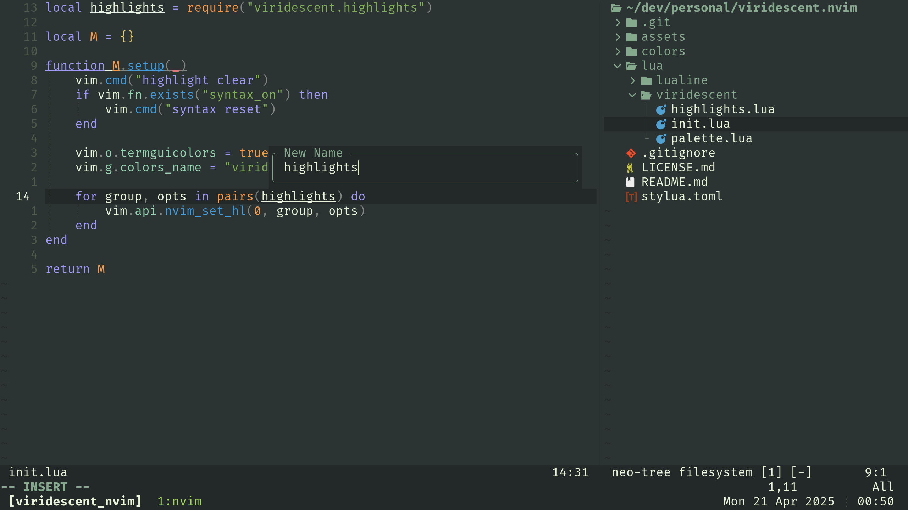

# Viridescent

A minty green Neovim colorscheme that is easy on the eyes.

Inspired by the [Monkeytype](https://monkeytype.com) theme of the same name,
and [ribru17's Bamboo](https://github.com/ribru17/bamboo.nvim) theme.



## Features

Plugin support:

- LSP and Diagnostics
- [Lazy](https://github.com/folke/lazy.nvim)
- [Mason](https://github.com/williamboman/mason.nvim)
- [Treesitter](https://github.com/nvim-treesitter/nvim-treesitter)
- [Telescope](https://github.com/nvim-telescope/telescope.nvim)
- [Lualine](https://github.com/nvim-lualine/lualine.nvim)
- [Neotree](https://github.com/nvim-neo-tree/neo-tree.nvim)
- [nvim-cmp](https://github.com/hrsh7th/nvim-cmp)
- [gitsigns](https://github.com/lewis6991/gitsigns.nvim)
- [leap](https://github.com/ggandor/leap.nvim)
- [snacks.input](https://github.com/folke/snacks.nvim/blob/main/docs/input.md)
- [undotree](https://github.com/mbbill/undotree)

I made Viridescent purely for myself, so plugin support is limited to what I use,
have previosuly used, and/or care about. But, if you like it and want to add
something, contributions are welcome!

## Installation

Use you favourite package manager, such as [Lazy](https://github.com/folke/lazy.nvim):

```lua
{
    'mecha/viridescent.nvim',
}
```

Then activate it as you would any other colorscheme:

```lua
vim.cmd("colorscheme viridescent")
```

```vim
colorscheme viridescent
```

## Configuration

Configuration options may optionally be passed to `setup()`.

```lua
require("viridescent").setup({
    overrides = {},
})
```

The default value will be used for any omitted option. No option is required.

> [!IMPORTANT]
> Make sure to call `setup()` **BEFORE** applying the colorscheme!

## Acknowledgements

- [ashharrrrr](https://github.com/ashharrrrr) who [contributed](https://github.com/monkeytypegame/monkeytype/pull/3521)
the original viridescent theme to [Monkeytype](https://monkeytype.com).
- [ribru17/bamboo](https://github.com/ribru17/bamboo.nvim) for being close-enough
with syntax colors that I liked.
